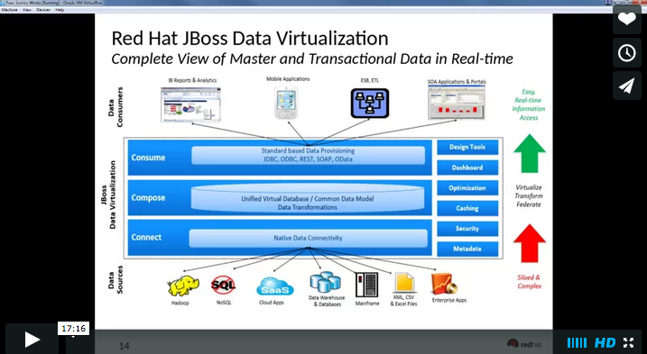

JBoss BRMS & JBoss DV Integration Demo
======================================
This is a demo project to get you started with automatically installing two EAP instances, one with JBoss 
BRMS product and the other with JBoss DV product configured and installed.

There will be various example projects the demonstrate some of the available scenarios around working with 
the capabilities of these two product.


Quickstart
----------

1. [Download and unzip.](https://github.com/kpeeples/dv-brms-integration-demo/archive/master.zip)

2. Add products to installs directory.

3. Run 'init.sh' or 'init.bat' file. 'init.bat' must be run with Administrative privileges. 

Follow the instructions on the screen to start JBoss BRMS server and JBoss DV server.

   ```
   Start JBoss BRMS server:                                                       
                                                                                       
     $ ./target/jboss-eap-6.1/bin/standalone.sh -Djboss.socket.binding.port-offset=100 
                                                                                       
   In seperate terminal start JBoss DV server:                                         
                                                                                       
     $ ./target/jboss-eap-6.1.dv/bin/standalone.sh                                     
                                                                                       
   Login to business central to build & deploy BRMS rules project at:                     
                                                                                       
     http://localhost:8180/business-central     (u:quickstartUser/p:quickstartPwd1!)                      
                                                                                       
   Build & Deploy JBoss BRMS project:

    -Choose menu option `Authoring` -> `Project Authoring`  
    -Choose the following options under `Project Explorer`:  
        Organizational Unit:  example  
        Repository Name:      jboss-brms-repository  
        BRMS Kmodule:         helloworld-brms-kmodule  
    -Next, click on `Tools` and `Project Editor`  
    -In the tab on the right, click on `Build & Deploy`.   
      * It will prompt you with a message: "Also save possible changes to project?". Click `Yes`.  
      * You are prompted for a comment. Add a comment and click on `Save` button.  
    -This deploys the `org.jboss.quickstarts.brms:helloworld-brms-kmodule:1.0.0` artifact to the BRMS Maven repository. You can verify the deployment choosing menu option `Deployment` --> `Artifact Repository`.  


   As a developer you have an application project simulated as a unit test in             
   projects/brmsquickstart/helloworld-brms which you can run with the maven command:      
                                                                                       
     $ mvn clean test -f projects/brmsquickstart/helloworld-brms/pom.xml -s support/quickstartsettings.xml -Penable-test,brms                        
                                                                                       
   View the Virtual Database Project:                                                                     
                                                                                       
     Import the DV project into JBDS with the Teiid tools installed.  

     See the How to guide for more detail.  
   ```

Optional Docker Install
-----------------------
The following steps can be used to configure and run the demo in a docker container

1. [Download and unzip.](https://github.com/jbossdemocentral/brms-fuse-integration-demo/archive/master.zip).

2. Add products to installs directory.

3. Copy Dockerfile and .dockerignore files in support/docker directory to the project root.

4. Build demo image

	```
	docker build -t jbossdemocentral/dv-brms-integration-demo .
	```
5. Start demo container

	```
	docker run --it -p 9990:9990 -p 9999:9999 -p 8080:8080 -p 31000:31000 -p 10090:10090 -p 10099:10099 -p 8180:8180 jbossdemocentral/dv-brms-integration-demo
	```

6. Login, build and deploy JBoss BPM Suite process project at http://<DOCKER_HOST>:8080/business-central (u:erics/p:bpmsuite1!).

7. Login to business central to build & deploy BRMS rules project at:

     http://<DOCKER_HOST>:8180/business-central     (u:quickstartUser/p:quickstartPwd1!)                  

   Build & Deploy JBoss BRMS project:

    -Choose menu option `Authoring` -> `Project Authoring`
    -Choose the following options under `Project Explorer`:
        Organizational Unit:  example
        Repository Name:      jboss-brms-repository
        BRMS Kmodule:         helloworld-brms-kmodule
    -Next, click on `Tools` and `Project Editor`
    -In the tab on the right, click on `Build & Deploy`.
      * It will prompt you with a message: "Also save possible changes to project?". Click `Yes`.
      * You are prompted for a comment. Add a comment and click on `Save` button.
    -This deploys the `org.jboss.quickstarts.brms:helloworld-brms-kmodule:1.0.0` artifact to the BRMS Maven repository. You can verify the deployment choosing menu option `Deployment` --> `Artifact Repository`.


   As a developer you have an application project simulated as a unit test in
   projects/brmsquickstart/helloworld-brms. Modifications are required to update the location of the Teiid server (DV). Modify the HelloWorldBRMSTest.java file in the helloworld-brms project with the following:

 
    String url = "jdbc:teiid:CustomerContextVDB@mm://<DOCKER_HOST>:31000";
 

Run the unit test with the maven command:

     $ mvn clean test -f projects/brmsquickstart/helloworld-brms/pom.xml -s support/quickstartsettings.xml -Penable-test,brms -Dbrms.host=<DOCKER_HOST>                        

   View the Virtual Database Project:

     Import the DV project into JBDS with the Teiid tools installed.

     See the How to guide for more detail.
  

Additional information can be found in the jbossdemocentral docker [developer repository](https://github.com/jbossdemocentral/docker-developer)


Use Case 1 
----------  

**Objective**   

Deteremine what offers or discounts can be offered to the customer according to the customer context   

**Problem**   

Call center agents don't have easy access to all the data and the business rules are manual   

**Solution**   

Use Data Virtualization to create a unified view for a custoemr context which can then be applied to business rules in BRMS to automatically determine the offers or discounts for the customer   

**Description:**  

Data Driven Business Decisions Made easy.  


Supporting Articles
-------------------

[DV - Example of two federated datasources](https://developer.jboss.org/docs/DOC-18404)

[BRMS - A basic JBoss BRMS quickstart](http://www.jboss.org/quickstarts/brms/helloworld-brms) 


Released versions
-----------------

See the tagged releases for the following versions of the product:

- v1.3 - JBoss BRMS 6.0.3, JBoss DV 6.0.0, optional docker installation added.

- v1.2 - JBoss BRMS 6.0.3, JBoss DV 6.0.0, initial demo projects installed and improved windows init.bat installation.

- v1.1 - JBoss BRMS 6.0.2, JBoss DV 6.0.0, and initial demo projects installed.

- v1.0 - Kenny Peeples initial setup for webinar on this topic in July 2014.


[](http://vimeo.com/user16928011/dv-brms-integrated-demo-part1)

[](http://vimeo.com/user16928011/dv-brms-integrated-demo-part2)

[](http://vimeo.com/user16928011/dv-brms-integrated-demo-part3) 

[](http://vimeo.com/user16928011/dv-brms-integrated-demo-part4) 

